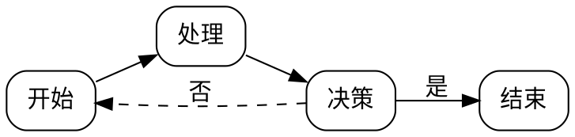

# Markdown Visualizer 插件使用手册

> 一个功能强大的 Obsidian 插件，支持在笔记中渲染多种可视化图表

## 📋 目录

- [功能特性](#功能特性)
- [安装方法](#安装方法)
- [渲染器介绍](#渲染器介绍)
  - [Canvas 渲染器](#canvas-渲染器)
  - [Graphviz 渲染器](#graphviz-渲染器)
  - [Infographic 渲染器](#infographic-渲染器)
  - [Vega 渲染器](#vega-渲染器)
- [插件设置](#插件设置)
- [常见问题](#常见问题)

---

## 功能特性

✅ **Canvas 渲染器** - 渲染 JSON Canvas 格式的节点图
✅ **Graphviz 渲染器** - 支持 DOT 语言的流程图和关系图
✅ **Infographic 渲染器** - 使用简洁 DSL 创建信息图表
✅ **Vega 渲染器** - 渲染 Vega/Vega-Lite 数据可视化图表

### 主要特点

- 🎨 **自动主题适配** - 跟随 Obsidian 深色/浅色主题
- 🔧 **灵活配置** - 丰富的自定义选项
- 📱 **响应式设计** - 自动适应不同屏幕尺寸
- ⚡ **高性能** - 优化的渲染引擎
- 🌈 **多色彩方案** - Infographic 支持 6 种预设颜色主题

---

## 安装方法

### 方式一：手动安装（推荐）

1. 将插件文件复制到 Obsidian 插件目录：
   ```
   .obsidian/plugins/markdown-visualizer/
   ├── main.js
   ├── manifest.json
   └── styles.css
   ```

2. 在 Obsidian 中：
   - 打开 `设置` → `第三方插件`
   - 关闭 `安全模式`
   - 刷新插件列表
   - 启用 `Markdown Visualizer`

3. 重新加载 Obsidian（`Ctrl + R` / `Cmd + R`）

### 方式二：开发模式

将项目克隆到 `.obsidian/plugins/` 目录后，在 Obsidian 中启用插件。

---

## 渲染器介绍

### Canvas 渲染器

**语法标识**：````canvas`

将 JSON Canvas 格式渲染为 SVG 图表，支持节点、边、分组等元素。

#### 基础示例

````markdown
```canvas
{
  "nodes": [
    {
      "id": "node1",
      "type": "text",
      "text": "开始",
      "x": 0,
      "y": 0,
      "width": 120,
      "height": 60,
      "color": "4"
    },
    {
      "id": "node2",
      "type": "text",
      "text": "处理",
      "x": 200,
      "y": 0,
      "width": 120,
      "height": 60,
      "color": "2"
    }
  ],
  "edges": [
    {
      "id": "edge1",
      "fromNode": "node1",
      "fromSide": "right",
      "toNode": "node2",
      "toSide": "left"
    }
  ]
}
```
````

#### 支持的节点类型

- **text** - 文本节点
- **file** - 文件节点
- **link** - 链接节点
- **group** - 分组容器

#### 颜色预设

| 编号 | 颜色 | 描述 |
|------|------|------|
| 1 | 红色 | #e03131 |
| 2 | 橙色 | #fd7e14 |
| 3 | 黄色 | #fab005 |
| 4 | 绿色 | #40c057 |
| 5 | 青色 | #15aabf |
| 6 | 紫色 | #7950f2 |

#### 新特性：多行文本支持

- ✅ 自动换行
- ✅ 文本溢出省略
- ✅ 智能垂直居中

---

### Graphviz 渲染器

**语法标识**：````dot` 或 ````graphviz`

使用 DOT 语言创建流程图、状态图、依赖图等。

#### 基础示例

````markdown

````

#### 支持的布局引擎

| 引擎 | 适用场景 | 特点 |
|------|----------|------|
| dot | 层次结构图 | 分层布局，适合流程图 |
| neato | 弹簧模型图 | 力导向布局 |
| fdp | 力导向图 | 适合大型图 |
| sfdp | 超大型图 | 可扩展的力导向布局 |
| circo | 循环图 | 环形布局 |
| twopi | 径向图 | 辐射状布局 |

#### 新特性：增强的错误处理

- ✅ 捕获 DOT 语法错误
- ✅ 显示详细错误信息
- ✅ 异步渲染支持

---

### Infographic 渲染器

**语法标识**：````infographic`

使用简洁的 DSL 创建专业的信息图表。

#### 基础示例

````markdown
```infographic
infographic list-grid-badge-card
data
  title 服务特性
  desc 平台能力概览
  items
    - label 分析
      desc 实时数据洞察
      value 95
    - label 安全
      desc 企业级防护
      value 99
    - label 扩展性
      desc 自动扩容基础设施
      value 98
```
````

#### 支持的模板类型

**1. 网格布局系列 (list-grid-*)**

- `list-grid-badge-card` - 带徽章的卡片网格
- `list-grid-icon-card` - 带图标的卡片网格
- `list-grid-image-card` - 带图片的卡片网格

**2. 横向列表系列 (list-row-*)**

- `list-row-badge` - 横向徽章列表
- `list-row-icon` - 横向图标列表
- `list-row-image` - 横向图片列表

**3. 纵向列表系列 (list-column-*)**

- `list-column-badge` - 纵向徽章列表
- `list-column-icon` - 纵向图标列表
- `list-column-image` - 纵向图片列表

**4. 时间线系列 (sequence-timeline-*)**

- `sequence-timeline-simple` - 简洁时间线
- `sequence-timeline-alternate` - 交替时间线

**5. 步骤系列 (sequence-steps-*)**

- `sequence-steps-vertical` - 纵向步骤
- `sequence-steps-horizontal` - 横向步骤

**6. 对比系列 (compare-*)**

- `compare-simple` - 简单对比
- `compare-table` - 表格对比
- `compare-swot` - SWOT 分析

**7. 漏斗图系列 (funnel-*)** ✨ 新增

- `funnel-simple` - 转化漏斗
- 适用于销售转化、招聘流程等场景

**8. 进度指标系列 (progress-*)** ✨ 新增

- `progress-bar` - 进度条
- 适用于项目进度、任务完成度、技能评估

**9. 路线图系列 (roadmap-*)** ✨ 新增

- `roadmap-vertical` - 纵向路线图
- 支持状态标识（done/current/pending）
- 适用于产品规划、学习路径、项目时间线

**10. 价格表系列 (pricing-*)** ✨ 新增

- `pricing-table` - 价格表
- 支持推荐标记（recommended/popular）
- 适用于产品定价、服务套餐、会员方案

#### DSL 语法说明

```
infographic <模板名称>
data
  title <标题>
  desc <描述>
  footer <页脚>
  items
    - label <标签>
      desc <描述>
      value <数值>
      icon <图标>
      status <状态>
      children
        - label <子标签>
          desc <子描述>
```

#### 新特性：主题配色

在插件设置中选择 Infographic 强调色：

- **默认** - 跟随 Obsidian 主题色
- **蓝色** - #3b82f6
- **绿色** - #10b981
- **紫色** - #8b5cf6
- **红色** - #ef4444
- **橙色** - #f59e0b

#### 新模板使用示例

**漏斗图示例**：

````markdown
```infographic
infographic funnel-simple
data
  title 销售转化漏斗
  items
    - label 访问网站
      value 10000
    - label 注册用户
      value 5000
    - label 付费用户
      value 1000
```
````

**进度指标示例**：

````markdown
```infographic
infographic progress-bar
data
  title 项目进度
  items
    - label 前端开发
      value 75
      desc 剩余 2 周
    - label 后端开发
      value 60
      desc 剩余 3 周
```
````

**路线图示例**：

````markdown
```infographic
infographic roadmap-vertical
data
  title 产品路线图
  items
    - label Q1 核心功能
      desc 基础架构开发
      value 2026 Q1
      status done
    - label Q2 功能增强
      desc 添加高级功能
      value 2026 Q2
      status current
```
````

**价格表示例**：

````markdown
```infographic
infographic pricing-table
data
  title 定价方案
  items
    - label 免费版
      value 0
      desc 个人用户
      children
        - label 5 个项目
        - label 基础功能
    - label 专业版
      value 99
      desc 成长型企业
      status recommended
      children
        - label 无限项目
        - label 高级功能
```
````

---

### Vega 渲染器

**语法标识**：````vega` 或 ````vega-lite`

使用 Vega/Vega-Lite 语法创建数据驱动的可视化图表。

#### 基础示例

````markdown
```vega-lite
{
  "$schema": "https://vega.github.io/schema/vega-lite/v5.json",
  "data": {
    "values": [
      {"category": "A", "value": 28},
      {"category": "B", "value": 55},
      {"category": "C", "value": 43}
    ]
  },
  "mark": "bar",
  "encoding": {
    "x": {"field": "category", "type": "nominal"},
    "y": {"field": "value", "type": "quantitative"}
  }
}
```
````

#### 支持的图表类型

- 📊 柱状图 (bar)
- 📈 折线图 (line)
- 📉 面积图 (area)
- 🔵 散点图 (point)
- 🥧 饼图 (arc)
- 🗺️ 热力图 (rect)
- 更多...

---

## 插件设置

在 `设置 → 第三方插件 → Markdown Visualizer` 中配置：

### Canvas 设置

- **启用 Canvas** - 开启/关闭 Canvas 渲染器
- **默认宽度** - Canvas 渲染的默认宽度（像素）
- **默认高度** - Canvas 渲染的默认高度（像素）

### Graphviz 设置

- **启用 Graphviz** - 开启/关闭 Graphviz 渲染器
- **布局引擎** - 选择默认的布局算法
  - dot (分层布局)
  - neato (弹簧模型)
  - fdp (力导向)
  - sfdp (大型图)
  - circo (环形)
  - twopi (径向)

### Infographic 设置

- **启用 Infographic** - 开启/关闭 Infographic 渲染器
- **强调色主题** - 选择信息图的配色方案
  - 默认（跟随 Obsidian）
  - 蓝色
  - 绿色
  - 紫色
  - 红色
  - 橙色

### Vega 设置

- **启用 Vega** - 开启/关闭 Vega 渲染器
- **显示操作按钮** - 在图表中显示交互按钮（导出、查看等）

### 主题设置

- **配色主题** - 可视化组件的整体配色
  - 自动（跟随 Obsidian）
  - 浅色
  - 深色

---

## 常见问题

### Q: 图表不显示怎么办？

**A:** 检查以下几点：

1. 确保插件已启用
2. 重新加载 Obsidian（`Ctrl + R` / `Cmd + R`）
3. 切换到阅读模式查看（`Ctrl + E`）
4. 检查代码块语法是否正确
5. 查看控制台是否有错误信息（`Ctrl + Shift + I`）

### Q: 如何查看错误信息？

**A:** 插件会在图表位置显示错误提示，包含详细的错误信息。

### Q: Canvas 文本溢出怎么办？

**A:** 新版本已支持：
- 自动文本换行
- 溢出文本截断（显示省略号）
- 调整节点的 `width` 和 `height` 参数

### Q: 如何自定义 Infographic 颜色？

**A:** 在插件设置中选择 `Infographic 设置 → 强调色主题`，可选择 6 种预设颜色。

### Q: Graphviz 渲染失败？

**A:** 检查 DOT 语法是否正确：
- 节点名称不能包含特殊字符（或使用引号）
- 确保所有语句以分号结尾
- 检查括号是否匹配

### Q: Vega 图表需要 `$schema` 字段吗？

**A:** 是的，必须包含 `$schema` 字段以指定 Vega/Vega-Lite 版本。

---

## 更新日志

### 最新版本特性

#### ✨ 新增功能

1. **Canvas 渲染器优化**
   - 支持多行文本渲染
   - 自动文本换行
   - 智能溢出处理（省略号）
   - 改进垂直居中对齐

2. **Graphviz 渲染器改进**
   - 添加错误处理机制
   - 捕获 DOT 语法错误
   - 显示详细错误信息

3. **Infographic 主题配置**
   - 新增 5 种预设颜色主题
   - 支持自定义强调色
   - 完整的 CSS 变量系统

4. **Infographic 新增 4 种模板** ✨
   - **漏斗图 (funnel-simple)** - 转化流程可视化
     - 自动宽度计算
     - 适用于销售漏斗、招聘流程
   - **进度指标 (progress-bar)** - 项目进度展示
     - 带动画的进度条
     - 支持百分比显示
   - **路线图 (roadmap-vertical)** - 时间线规划
     - 支持状态标识（done/current/pending）
     - 支持子任务显示
   - **价格表 (pricing-table)** - 定价方案展示
     - 支持推荐标记
     - 卡片式响应布局

---

## 技术支持

- 📧 报告问题：[GitHub Issues](https://github.com/your-repo/issues)
- 📖 查看文档：本 README 文件
- 💬 讨论交流：[GitHub Discussions](https://github.com/your-repo/discussions)

---

## 开发信息

### 技术栈

- **Obsidian API** - 插件框架
- **d3-graphviz** - Graphviz 渲染
- **vega-embed** - Vega 图表渲染
- **TypeScript** - 类型安全
- **CSS Variables** - 主题适配

### 项目结构

```
markdown-viewer-extension/
├── .obsidian/plugins/markdown-visualizer/
│   ├── main.js              # 插件主文件
│   ├── manifest.json        # 插件配置
│   └── styles.css           # 样式文件
├── README.md                # 本文档
└── 插件测试.md              # 测试用例
```

---

## 许可证

本项目采用 MIT 许可证。

---

## 致谢

感谢以下开源项目：

- [Obsidian](https://obsidian.md/)
- [d3-graphviz](https://github.com/magjac/d3-graphviz)
- [Vega](https://vega.github.io/)
- [Vega-Lite](https://vega.github.io/vega-lite/)

---

**享受可视化创作！** 🎉
